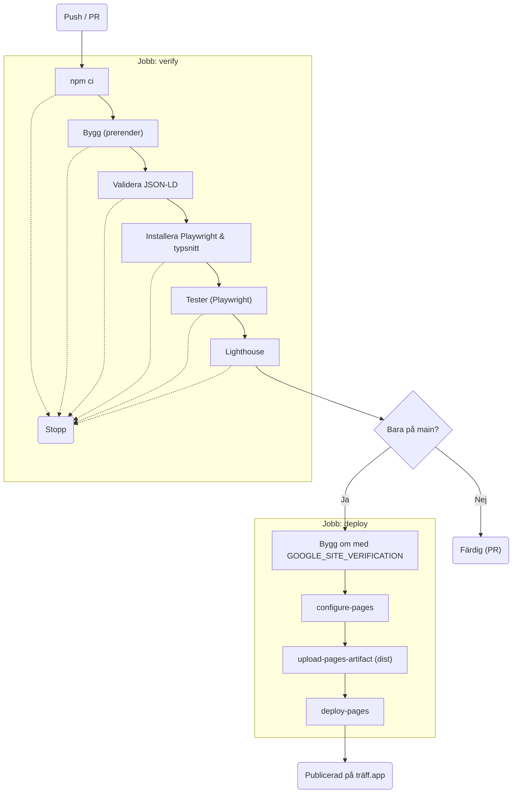

# brfv2-lovable-dokument — bara Dokument, fristående

Ett litet Vite/React-projekt med Dokument-skärmen ur Träff, för att kunna
laddas upp i Lovable (eller öppnas var som helst) utan Python-backend, Tauri
eller resten av appen. Listan och PDF:erna är riktiga: samma fixtures som
`brfv2-lovable`, sparade i `src/fixtures/` och `public/pdf/`.

```bash
cd brfv2-lovable-dokument
npm install
npm run dev        # http://localhost:5173
```

Chatten (Fråga dokumenten) ligger i syskonfoldern `brfv2-lovable/`.

## Vad som är delat med riktiga kodbasen, och vad som är paketets eget

Samma sökvägar som `brfv2-mockup/src/`, så en ändring här kopieras tillbaka rakt av:

```bash
npm run sync-back            # kopierar de delade filerna till ../brfv2-mockup/src
npm run sync-back -- --diff  # visar bara skillnaden först
```

| Delat (verbatim, synkas) | Paketets eget (synkas inte) |
|---|---|
| `src/theme.css`, `src/App.css` — alla tokens och all styling | `src/App.jsx` — skalet med registret och läsvyn |
| `src/components/PdfPane.jsx`, `src/pdfCache.js` — sidan ritad med pdf.js | `src/api.js` — mockad backend ur fixtures |
| `src/components/TraffMark.jsx`, `Instrument.jsx` + `.css`, `EmptyState.jsx`, `datum.js` | `src/fixtures/`, `public/pdf/` — sparade dokument |
| `src/useSlashFocus.js`, `src/assets/` (typsnitten) | `index.html`, `src/main.jsx`, `vite.config.js` |

Ändrar du något i `App.jsx` som ska tillbaka: motsvarande kod ligger i
`brfv2-mockup/src/App.jsx` under `currentTab === 'docs'` och i läsvyn
(`selectedDocument`), med samma klassnamn — flytta för hand.

## Vad mocken gör

- Listan kommer ur `src/fixtures/documents.json`.
- Ett klick öppnar PDF:en i läsvyn (samma PdfPane som i appen).
- Uppladdning lägger filen i listan på den här datorn, med märket Ny. Den
  sparas inte; omladdning återställer fixtures.
- Borttagning tar bara bort raden ur den här sessionen.

## Sajtadress

Canonical, Open Graph, Twitter-bild, JSON-LD, `sitemap.xml` och `robots.txt`
byggs från miljövariabeln `SITE_URL`. Utan variabeln är adressen den som är
publicerad i dag:

`https://xn--trff-moa.app/` (träff.app, punycode i metadata)

GitHub Pages-workflowen sätter `SITE_URL` och `VITE_BASE=/` tillsammans. `sitemap.xml` och `robots.txt` skrivs till `dist/` vid `npm run build`
och ligger inte som statiska filer i `public/`.

Search Console verifieras med repository-variabeln `GOOGLE_SITE_VERIFICATION`
(Actions → Variables, inte en incheckad kod). Om den är satt skriver bygget
`<meta name="google-site-verification">` i sidhuvudet. Utan variabeln blir
taggen inte med.

Domänen träff.app (registrerad hos STRATO) pekar på GitHub Pages: A- och AAAA-poster
på apex och `www` som CNAME. Custom domain är satt under repots Settings → Pages;
eftersom sajten deployas med Actions behövs ingen `CNAME`-fil. För att bygga
lokalt mot den gamla projektadressen:

```bash
SITE_URL=https://itsimonfredlingjack.github.io/traffwebsite/ VITE_BASE=/traffwebsite/ npm run build
```

## Pipeline



**verify**
- **npm ci**: Installerar beroenden för Node 22.
- **Bygg (prerender)**: Kör `npm run build` med `VITE_BASE=/` och `SITE_URL=https://xn--trff-moa.app/`. Vites bygge (`vite build` och `vite build --ssr`) följs av `node scripts/prerender.js`, som skriver HTML, `robots.txt` och `sitemap.xml` till `dist/`. Fallerar om bygget kraschar.
- **Validera JSON-LD**: Kör `node scripts/validate-jsonld.mjs`. Validerar sidans JSON-LD mot schema-dts och kontrollerar att FAQPage-texten stämmer överens med det som renderas. Fallerar om datan är ogiltig eller texterna skiljer sig.
- **Installera Playwright & typsnitt**: Laddar ner Chromium och installerar `fonts-urw-base35` via apt, så att `citation-coverage` har tillgång till NimbusSans-Regular.afm för att mäta textbredder. Fallerar vid nätverksproblem.
- **Tester (Playwright)**: Kör `npx playwright test tests/seo-regression.spec.js tests/citation-coverage.spec.js` med `CI=true`. Det gör att testerna körs med Playwrights egna Chromium-version (channel 'chromium'). Testar bland annat "axe finds no contrast or target-size violations in any demo state", "pdf.js stays unloaded until the demo is on screen, then the story runs", "status mark draws a core only when a passage is verified", "marked rects cover each cited passage line by line" och "narrow headers, the fitted page, and a refusal claim no false hit". Fallerar om något test misslyckas (vid fel sparas artefakten `playwright-results`).
- **Lighthouse**: Kör `npm run lighthouse` (`scripts/lighthouse-check.mjs`) mot `vite preview`, med `CHROME_PATH` satt till Playwrights Chromium. Fallerar om resultatet understiger gränserna: performance 0.90, accessibility 0.97, best-practices 0.95, seo 0.97.

**deploy**
Körs inte på `pull_request`, utan bara på `main` (förutsatt att `verify` gick grönt). Installerar Node 22, kör `npm ci` och bygger sedan om sajten med repots hemlighet `GOOGLE_SITE_VERIFICATION`. Därefter konfigureras GitHub Pages via `configure-pages`, mappen `dist` laddas upp som en artefakt via `upload-pages-artifact` och slutligen publiceras sajten med `deploy-pages`.

### Köra lokalt

```bash
npm run build
node scripts/validate-jsonld.mjs
npm run test:seo   # kräver installerad Chrome; typsnittet via fonts-urw-base35 eller AFM_PATH=/sökväg/NimbusSans-Regular.afm
npm run lighthouse # CHROME_PATH=/sökväg/till/chrome om chrome-launcher inte hittar någon
```

Utanför CI körs skripten `scripts/visual-diff.mjs`, `scripts/render-og.mjs`, `scripts/generate-demo-pdfs.js` och `scripts/generate_assets.py` manuellt.

Sedan pipelinen sattes upp har även två nya saker tillkommit: `seo-regression` testar nu även datormenyns länkar, och `src/utils/scrollToSection.js` rättar scrollpositionen efter mjuk scroll.
